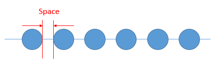
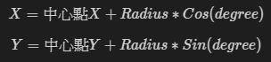
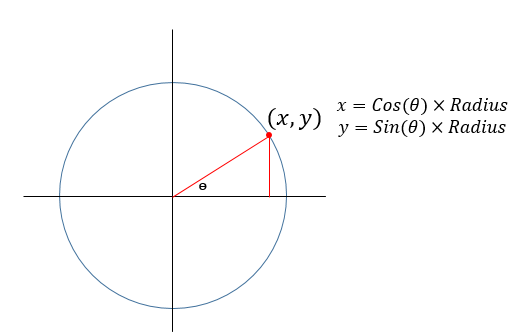
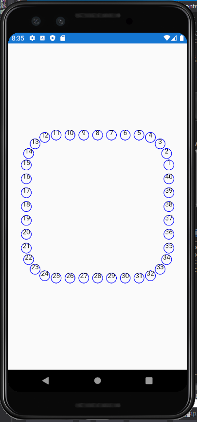

# XamarinFormsDrawShape
Xamarin.Forms using SkiaSharp package to create drawing path

## 前言
這個程式主要想在圓弧、圓形與直線上面根據給定的點的數量，在找到對應的位置，這個位置主要使用`笛卡爾座標以畫面的中心點為圓點`。

因此，要做到上述目標，手機的原點，必須從左上角移動到畫面的中心點。

## SkiaSharp 套件安裝
- SkiaSharp
- SkiaSharp.Views.Forms

## 圖形繪製
### 直線點
目前直線點僅針對頭尾不算點的方式，以間隔方式計算出點。

因為不計算頭尾，因此，將給定的點位數量 + 1，再拿他與長或寬去除，得到點與點之間的間距

如下圖，圖片中共有六個點，由於有 7 個間隔，所以要用點數 + 1 的方式



```cs
/// <summary>
/// 用來計算垂直線上給定數量的點位置
/// </summary>
/// <param name="lastPoint">前一個點的位置</param>
/// <param name="count">點的數量</param>
/// <param name="length">線段長度</param>
/// <param name="clocks">線的走向 (1往右走，-1 往左走)</param>
/// <param name="points">返回計算的所有點串列</param>
/// <returns>回傳最後一點</returns>
private Point VerticalPath(Point lastPoint, int count, double length, int clocks ,out List<Point> points) 
{
	points = new List<Point>();

	var gap = length / (count + 1);

	for(int i = 0; i < count; i++) 
	{
		points.Add(new Point
		{
			X = lastPoint.X,
			Y = lastPoint.Y + (clocks) * space * (i+1)
		});
	}

	return points[points.Count - 1];  // 回傳最後一筆點位
}
```

### 圓弧點
點的位置會在圓弧的頭尾開始算，這邊主要使用三角函數去找出圓弧上對應的座標





```cs
/// <summary>
/// 用來計算圓弧上給定點位的位置
/// </summary>
/// <param name="lastPoint">上一個點的位置</param>
/// <param name="count">點的數量</param>
/// <param name="angle">預計要走幾度</param>
/// <param name="startAngle">起始角度</param>
/// <param name="radius">半徑</param>
/// <param name="points">返回點位置串列</param>
/// <returns>回傳最後一點</returns>
private Point ArcPath(Point lastPoint, int count, double angle, double startAngle, double radius, out List<Point> points)
{
	points = new List<Point>();

	// 每一度 (由於這次頭尾要有點因此要先減 1)
	double perDegree = angle / (count - 1);

	double x, y;

  // 為了讓最後一點可以更準確因此另外處裡
	for(int i = 0; i< count -1; i++) {
		double degree = i + perDegree + startAngle;
		x = lastPoint.X + radius * Math.Cos(degree * Math.PI / 180);
		y = lastPoint.Y + radius * Math.Sin(degree * Math.PI / 180);

		points.Add(new Point{ X = x, Y = y});
	}
	x = lastPoint.X + radius * Math.Cos(startAngle * Math.PI / 180);
	y = lastPoint.Y + radius * Math.Sin(startAngle * Math.PI / 180);

	points.Add(new Point{X = x, Y = y}});

	return points[points.Count -1];
}
```

### 圓形
圓形基本上就不用考慮頭尾的問題，直接用 360 去除點數量即可。
```cs
/// <summary>
/// 用來計算圓形上點位的位置
/// </summary>
/// <param name="lastPoint">前一個點的位置</param>
/// <param name="count">點的數量</param>
/// <param name="startAngle">起始點</param>
/// <param name="radius">半徑</param>
/// <param name="points"></param>
/// <returns></returns>
private Point CirclePath(Point lastPoint, int count, double startAngle, double radius, out List<Point> points) 
{ 
	points = new List<Point>(); 
	
	// 每一度 
	double perDegree = 360 / count; 
	double x, y; 
	
	for (int i = 0; i < count; i++) 
	{ 
		double degree = i * perDegree + startAngle; 
		x = lastPoint.X + radius * Math.Cos(degree * Math.PI / 180); 
		y = lastPoint.Y + radius * Math.Sin(degree * Math.PI / 180); 
		
		points.Add(new Point { X = x, Y = y }); 
	} 
	return points[points.Count - 1]; 
}
```

## 圖形組合
基本上根據上面幾項原則，圓形與畫弧方向以逆時鐘方向去畫圖，即可兜出簡單的圖形。

例如，畫一個帶圓角的正方形，每個圓角與每個邊點數為 5
```cs
/// <summary>
/// 要繪製的圖形在這邊決定
/// </summary>
/// <param name="radius">圖形圓角半徑</param>
/// <param name="rectangeWidth">圖形寬度</param>
/// <param name="rectangleHeight">圖形高度</param>
/// <param name="dataPoint">欲返回的資料點</param>
private void GetShapePoint(double radius, double rectangleWidth, double rectangleHeight, out List<Point> dataPoint)
{ 
	dataPoint = new List<Point>(); 
	
	var points = GetCornerPoint(rectangleWidth, rectangleHeight); 
	// 右上角 
	var lastPoint = ArcPath(points[0], 5, 90, 0, radius, out var pointList); 
	dataPoint.AddRange(pointList); 
	
	// 水平線 
	HorizontalPath(lastPoint, 5, rectangleWidth, -1, out pointList); 
	dataPoint.AddRange(pointList);

  // 左上角 
	lastPoint = ArcPath(points[1], 5, 90, 90, radius, out pointList); 
	dataPoint.AddRange(pointList);

  // 垂直線 
	VerticalPath(lastPoint, 5, rectangleHeight, -1, out pointList); 
	dataPoint.AddRange(pointList); 
	
	// 左下角 
	lastPoint = ArcPath(points[2], 5, 90, 180, radius, out pointList); 
	dataPoint.AddRange(pointList); 
	
	// 水平線 
	HorizontalPath(lastPoint, 5, rectangleWidth, 1, out pointList); 
	dataPoint.AddRange(pointList); 
	
	// 右下角 
	lastPoint = ArcPath(points[3], 5, 90, 270, radius, out pointList); 
	dataPoint.AddRange(pointList); 
	
	// 垂直線 
	VerticalPath(lastPoint, 5, rectangleWidth, 1, out pointList); 
	dataPoint.AddRange(pointList); 
}
```
[](./Images/2021-07-14-17-49-24.png)

## 未來
未來可針對此功能，將想要的圖形，僅記錄圖形繪製的方式，就不用每次都要打開程式去修改參數。
